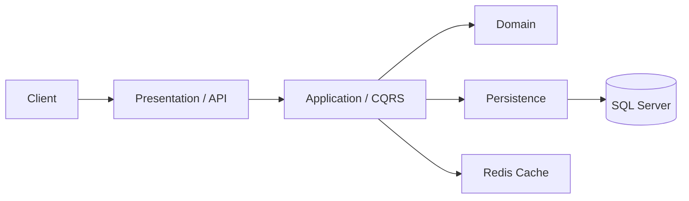

# ETicaret API

ETicaret API, ASP.NET Core ile gelistirilmis, e-ticaret senaryolarini temel alan katmanli bir backend projesidir. Projede kullanici islemleri, urun/kategori yonetimi, sepet, siparis, adres, mock odeme ve kargo surecleri API seviyesinde ele alinmistir.

Bu proje, sadece CRUD endpointlerinden olusan basit bir API yerine; gercek bir e-ticaret uygulamasinda beklenen is akislarini, rol bazli yetkilendirmeyi, validasyonlari, cache mekanizmasini ve is kurallarini uygulamayi hedefler.

## Ozellikler

- Kullanici kayit, giris, refresh token ve logout islemleri
- JWT tabanli authentication
- Role bazli authorization
- Admin ve customer rolleri
- Kullanici lockout ve hatali giris kontrolu
- Login audit kaydi
- Kategori yonetimi
- Urun yonetimi
- Urun arama, filtreleme, siralama ve sayfalama
- Redis cache destegi
- Sepet yonetimi
- Sepetten siparis olusturma
- Siparis durum yonetimi
- Siparis iptal islemi ve stok iadesi
- Siparis durum gecmisi
- Adres yonetimi
- Mock odeme islemi
- Kargo bilgisi ve takip numarasi ekleme
- FluentValidation ile request validasyonlari
- Global exception handling
- Audit log altyapisi
- Swagger/OpenAPI destegi

## Kullanilan Teknolojiler

- ASP.NET Core Web API
- Entity Framework Core
- SQL Server
- ASP.NET Core Identity
- JWT Bearer Authentication
- MediatR
- AutoMapper
- FluentValidation
- Redis
- Serilog
- Swagger / OpenAPI

## Mimari

Proje katmanli mimari yaklasimi ile ayrilmistir:

```txt
Core
  ETicaret.Domain
  ETicaret.Application
  ETicaret.Mapper
  ETicaret.Models

Infrastructure
  ETicaret.Persistence
  ETicaret.Infrastructure
  ETicaret.Redis

Presentation
  ETicaret.API
```

Genel akis:



## Proje Modulleri

### Auth

- Kullanici girisi
- Access token uretimi
- Refresh token yenileme
- Logout
- Lockout kontrolu
- Role bilgisinin token claimlerine eklenmesi

### Users

- Kullanici olusturma
- Yeni kullaniciya varsayilan customer rolunun atanmasi

### Categories

- Kategori olusturma
- Kategori listeleme
- Kategori detay goruntuleme
- Kategori guncelleme
- Kategori silme
- Alt kategori destegi

### Products

- Urun olusturma
- Urun listeleme
- Urun detay goruntuleme
- Urun guncelleme
- Urun silme
- Search, category, price range ve featured filtreleri
- SortBy ve SortDirection ile siralama
- Sayfalama
- Redis cache kullanimi

### Baskets

- Kullanici sepetini goruntuleme
- Sepete urun ekleme
- Sepetteki urun adedini guncelleme
- Sepetten urun silme
- Sepeti temizleme

### Orders

- Sepetten siparis olusturma
- Siparis detay goruntuleme
- Kullanici siparislerini listeleme
- Admin icin tum siparisleri listeleme
- Siparis durumunu guncelleme
- Siparisi iptal etme
- Siparis durum gecmisini goruntuleme
- Siparisi kargoya verme

### Addresses

- Adres ekleme
- Kullanici adreslerini listeleme
- Adres guncelleme
- Adres silme
- Varsayilan adres yonetimi
- Siparis olustururken adres kullanimi

### Payments

- Mock odeme alma
- Kullanici odemelerini listeleme
- Siparise ait odeme bilgisini goruntuleme
- Odeme sonrasi siparis durumunu guncelleme

## Ornek E-Ticaret Akisi

1. Kullanici kayit olur.
2. Kullanici login olur ve access token alir.
3. Urunleri listeler veya filtreler.
4. Sepetine urun ekler.
5. Adres olusturur.
6. Sepetten siparis olusturur.
7. Siparis icin mock odeme yapar.
8. Admin siparis durumunu gunceller.
9. Admin siparisi kargoya verir.
10. Kullanici siparisini ve durum bilgisini goruntuler.

## Rol Bazli Yetkiler

| Modul | Customer | Admin |
| --- | --- | --- |
| Auth | Login, refresh token, logout | Login, refresh token, logout |
| Categories | Listeleme ve detay goruntuleme | Olusturma, guncelleme, silme, listeleme |
| Products | Listeleme, detay, arama ve filtreleme | Olusturma, guncelleme, silme, listeleme |
| Baskets | Kendi sepetini yonetme | - |
| Addresses | Kendi adreslerini yonetme | - |
| Orders | Kendi siparislerini olusturma ve goruntuleme | Tum siparisleri goruntuleme, durum guncelleme, iptal, kargoya verme |
| Payments | Kendi siparisleri icin odeme yapma ve odemelerini goruntuleme | Siparise ait odeme bilgisini goruntuleme |

## Ornek Request/Response

### Login

```http
POST /api/auth/login
Content-Type: application/json
```

```json
{
  "usernameEmail": "admin@gmail.com",
  "password": "123456",
  "rememberMe": true
}
```

```json
{
  "user": {
    "id": "0a1bd32f-a87d-4aab-8e68-07df40bbaf06",
    "userName": "admin",
    "email": "admin@gmail.com",
    "roles": ["ADMIN"]
  },
  "token": {
    "accessToken": "jwt-access-token",
    "expiration": "2026-06-20T12:00:00Z",
    "refreshToken": "refresh-token",
    "refreshTokenExpiration": "2026-08-19T12:00:00Z"
  }
}
```

### Urun Listeleme

```http
GET /api/products?search=iphone&sortBy=Price&sortDirection=Desc&pageNumber=1&pageSize=10
```

```json
{
  "pagedData": [
    {
      "id": "19357444-1768-f111-8b6f-dc2148782f84",
      "name": "iPhone 15 128 GB",
      "slug": "iphone-15-128-gb",
      "price": 52999.99,
      "discountPrice": 48999.99,
      "stockQuantity": 20,
      "sku": "IPHONE-15-128-BLACK",
      "categoryName": "Elektronik"
    }
  ],
  "pageInfo": {
    "pageNumber": 1,
    "pageSize": 10,
    "totalRowCount": 1,
    "totalPageCount": 1,
    "hasNextPage": false
  }
}
```

### Sepetten Siparis Olusturma

```http
POST /api/orders/from-basket
Authorization: Bearer {accessToken}
Content-Type: application/json
```

```json
{
  "addressId": "f16942ac-8f6a-f111-8b72-dc2148782f84"
}
```

```json
{
  "orderId": "94d7cd03-246c-f111-8b72-dc2148782f84",
  "totalPrice": 127500
}
```

### Mock Odeme

```http
POST /api/payments/pay-order
Authorization: Bearer {accessToken}
Content-Type: application/json
```

```json
{
  "orderId": "94d7cd03-246c-f111-8b72-dc2148782f84"
}
```

```json
{
  "paymentId": "57873f25-246c-f111-8b72-dc2148782f84",
  "orderId": "94d7cd03-246c-f111-8b72-dc2148782f84",
  "amount": 127500,
  "status": "Succeeded",
  "transactionId": "MOCK-77105f8225a74f60895617393c4fb97d"
}
```

### Siparisi Kargoya Verme

```http
PUT /api/orders/{orderId}/ship
Authorization: Bearer {adminAccessToken}
Content-Type: application/json
```

```json
{
  "cargoCompany": "Yurtici Kargo",
  "trackingNumber": "TRK123456789"
}
```

```json
{
  "orderId": "94d7cd03-246c-f111-8b72-dc2148782f84",
  "cargoCompany": "Yurtici Kargo",
  "trackingNumber": "TRK123456789",
  "shippedDate": "2026-06-20T12:30:00Z"
}
```

## Kurulum

Projeyi klonlayin:

```bash
git clone https://github.com/BerkayUludogan/ETicaret-API.git
cd ETicaret-API
```

Gerekli ortamlar:

- .NET 10 SDK
- SQL Server
- Redis

`Presentation/ETicaret.API/appsettings.Development.json` veya local configuration dosyanizdaki degerleri kendi ortaminiza gore duzenleyin:

```json
{
  "ConnectionStrings": {
    "SQLServer": "Server=.;Database=ETicaretDb;Trusted_Connection=True;TrustServerCertificate=True"
  },
  "JWT": {
    "Audience": "your-audience",
    "Issuer": "your-issuer",
    "SecurityKey": "your-secret-key",
    "TokenExpirationInMinutes": 15,
    "RefreshTokenExpirationInDays": 60
  },
  "RedisCacheSettings": {
    "ConnectionString": "localhost:6379",
    "InstanceName": "Redis_ETicaret"
  }
}
```

Veritabanini olusturmak icin migrationlari uygulayin:

```bash
dotnet ef database update --project Infrastructure/ETicaret.Persistence --startup-project Presentation/ETicaret.API
```

Bagimlilikleri yukleyin ve projeyi build edin:

```bash
dotnet restore
dotnet build
```

Projeyi calistirin:

```bash
dotnet run --project Presentation/ETicaret.API
```

Swagger arayuzu development ortaminda aktif olur:

```txt
https://localhost:7044/swagger
```

## Ornek Endpointler

```http
POST /api/auth/login
POST /api/auth/refresh-token
POST /api/users

GET /api/categories
POST /api/categories

GET /api/products?pageNumber=1&pageSize=10
GET /api/products?search=iphone
GET /api/products?sortBy=Price&sortDirection=Desc
POST /api/products

GET /api/baskets/my-basket
POST /api/baskets/items
PUT /api/baskets/items/{basketItemId}

POST /api/orders/from-basket
GET /api/orders/my-orders
PUT /api/orders/{orderId}/status
PUT /api/orders/{orderId}/cancel
PUT /api/orders/{orderId}/ship

POST /api/addresses
GET /api/addresses/my-addresses

POST /api/payments/pay-order
GET /api/payments/my-payments
GET /api/payments/order/{orderId}
```

## Teknik Kararlar

- CQRS yapisi MediatR ile kuruldu.
- Request validasyonlari FluentValidation ile ayrildi.
- Is kurallari handler icinden ayri business rule siniflarina tasindi.
- Entity configuration islemleri EF Core configuration siniflari ile ayrildi.
- Urun ve kategori listeleme gibi okunma agirlikli islemlerde Redis cache kullanildi.
- Access token kisa sureli, refresh token daha uzun sureli olacak sekilde tasarlandi.
- Siparis olusturma gibi birden fazla tabloyu etkileyen islemlerde transaction yaklasimi tercih edildi.
- Siparis durum degisiklikleri ayri history tablosunda tutuldu.
- Odeme entegrasyonu gercek servis yerine mock provider mantigiyla tasarlandi.

## Gelistirme Durumu

Tamamlanan ana moduller:

- Auth
- Catalog
- Basket
- Order
- Address
- Payment
- Shipping

Planlanan gelistirmeler:

- Unit ve integration testler
- Docker Compose destegi
- README icin ekran goruntuleri veya mimari gorsel
- Daha kapsamli seed data
- Notification/email altyapisi
- Gercek payment provider entegrasyonu
